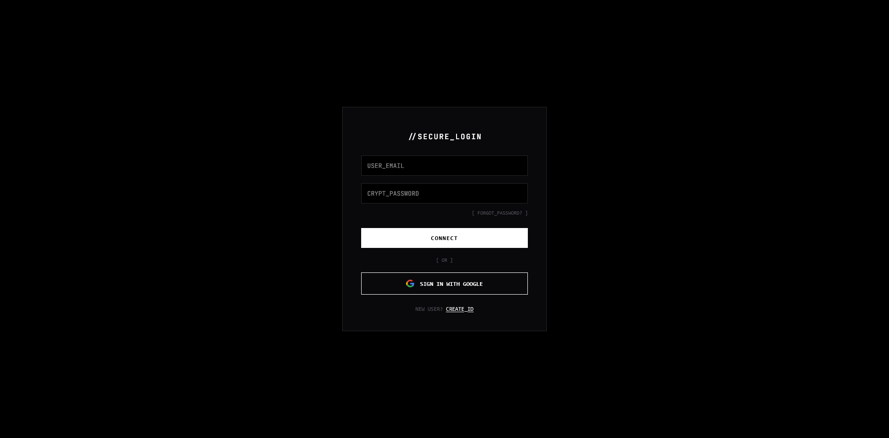
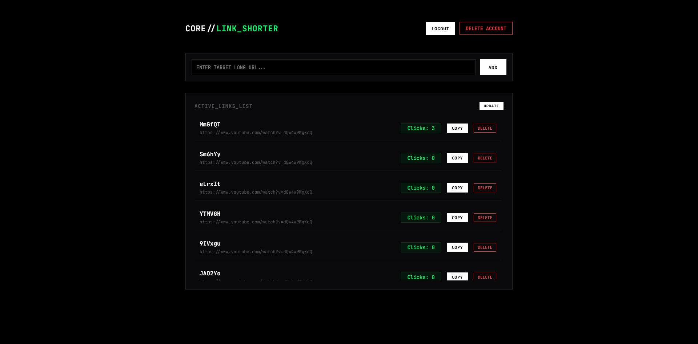
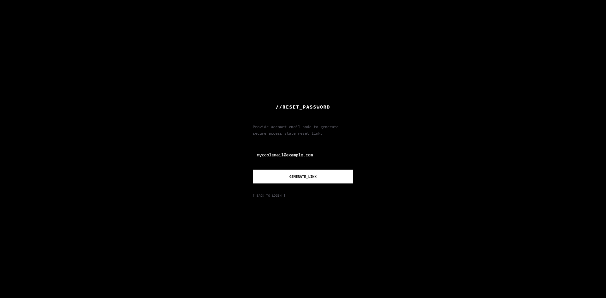
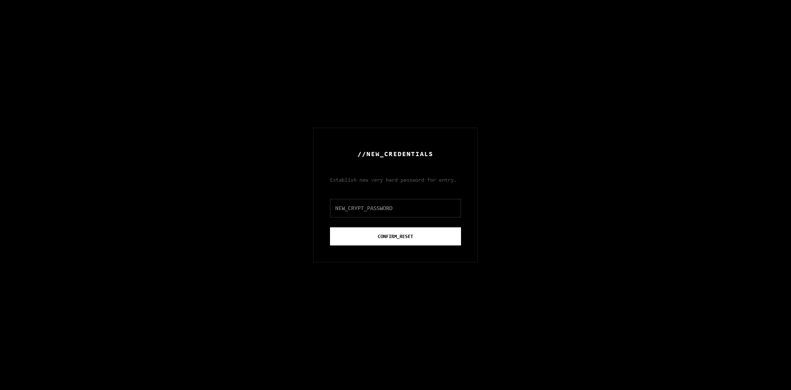
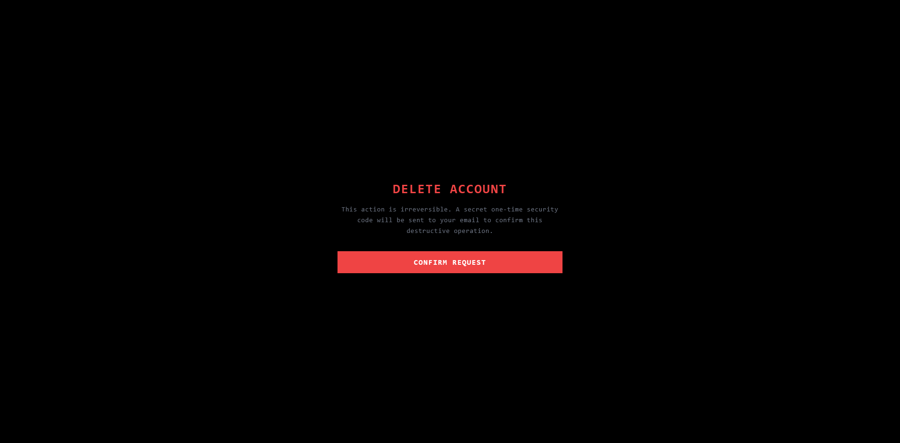
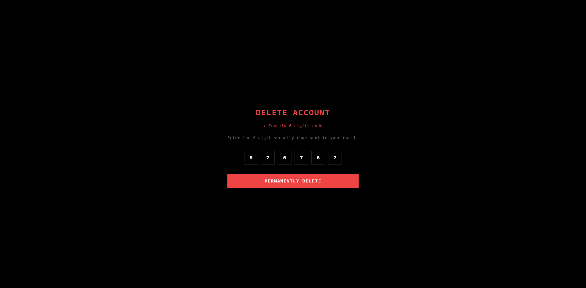

# 🔗 Link Shorter Service


Just good link shorter

---

## 📸 User Interface Showcase

| Login Page | Registration Page | Main Dashboard |
| :---: | :---: | :---: |
|  |  |  |

| Password Reset Request | Password Reset Confirm | Account Deletion (OTP) | Account Deletion (Success) |
| :---: | :---: | :---: | :---: |
|  |  |  |  |

---

## 🛠️ Tech Stack & Ecosystem

### Backend Architecture
* **Core Framework:** `FastAPI` (Asynchronous Python api-framework)
* **Data Validation:** `Pydantic v2` (Strict runtime typing and operational contracts)
* **Primary Database:** `PostgreSQL` (Relational persistent storage)
* **Caching & Session Store:** `Redis` (Lightning-fast URL redirection tracking)
* **Authentication & Security:** `Google OAuth2` Integration & Managed Session Tokens
* **Mailing System:** `fastapi-mail` (Verification & Password reset)

### Frontend Ecosystem
* **Core Library:** `React` (Functional components built on Vite)
* **Routing System:** `react-router-dom` (Declarative UI client-side state mapping)

---

## 📂 Project Architecture

```text
link-shorter/
├── .pytest_cache/             
├── .venv/                     
├── link-shorter-frontend/     
│   ├── node_modules/          
│   ├── src/                   
│   ├── .gitignore             
│   ├── Dockerfile             
│   ├── eslint.config.js       
│   ├── index.html             
│   ├── package-lock.json      
│   ├── package.json           
│   └── vite.config.js      
├── screenshots/               
├── src/                       
│   ├── api/                   
│   ├── cache/                 
│   ├── core/                  
│   ├── db/                    
│   ├── dependencies/          
│   ├── email/                 
│   ├── exceptions/            
│   ├── models/                
│   ├── repositories/          
│   ├── schemas/               
│   ├── security/              
│   ├── services/              
│   ├── utils/                 
│   └── main.py                
├── tests/                     
│   ├── conftest.py            
│   └── test_links.py          
│   └── test_auth.py           
├── .env                       
├── .gitignore                 
├── .python-version            
├── docker-compose.yml         
├── Dockerfile                 
├── pyproject.toml             
├── README.md                  
└── uv.lock                    
```

To build and run project, run the following command

```bash
  docker compose up --build
```

To run tests, run the following command

```bash
  python -m pytest -v
```


